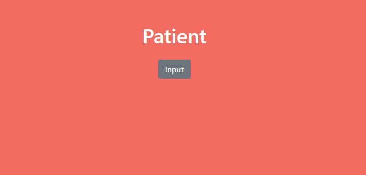
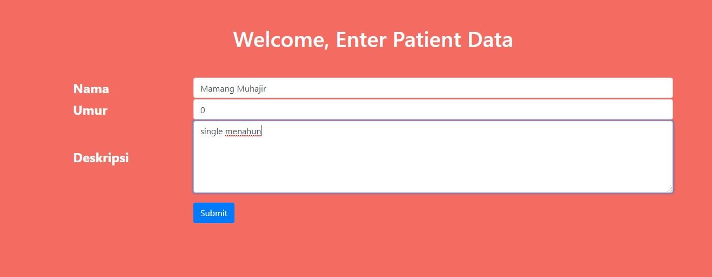
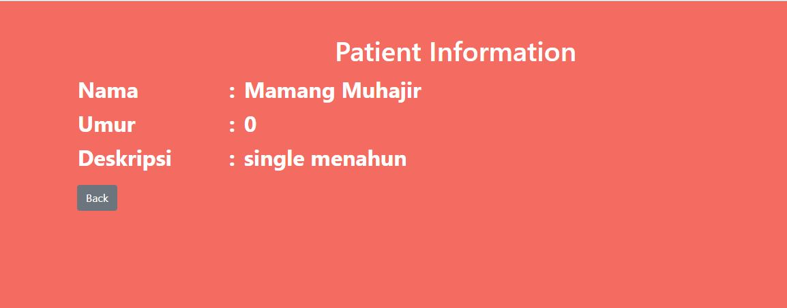

# Tugas 2 PBKK

## A. Deskripsi Singkat
- route '/' pada controller akan membukan halaman home.jsp
- pada home.jsp terdapat button yang akan merequest /formPatient ke HomeController
- pada homeController terdapat requestmapping yang mengambil value dari semua view
- controller akan mengembalikan view formPatient dan menginisialiasi kelas model
- data yang diinputkan berupa string namaPasien, string umurPasien, dan string Deskripsi
- Jika data yang diinputkan tidak kompatibel maka controller akan menampilkan halaman error
- Jika data sudah sesuai maka form akan mengirim hasil input ke route 'addPatient' yang akan ditangkap oleh controller untuk kemudian memasukkan data input kedalam kelas model yang telah diinisialisasi sebelumnya
- controller akan mengembalikan view detailPatient yang selanjutnya akan diisi dengan data yang telah dimasukkan sebelumnya dengan memanggil $[nama_atribut].

## B. Tampilan Form Entry

## C. Tampilan Hasil Data Entry
